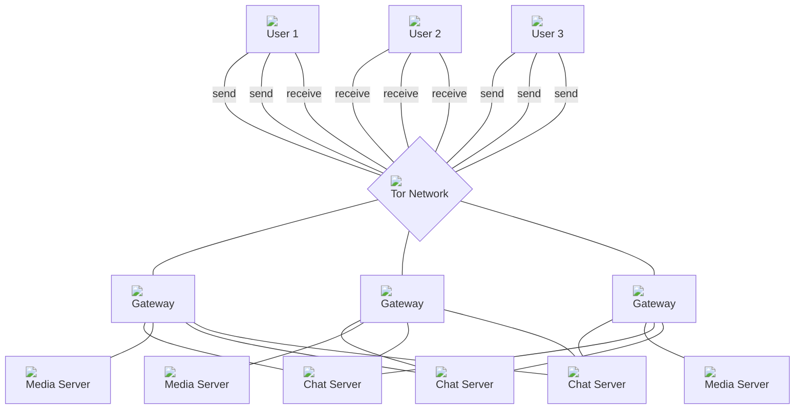

```mermaid
flowchart TD
A1[<img src='https://img.icons8.com/smartphone'>User 1</img>] ---- |send| C
A2[<img src='https://img.icons8.com/smartphone'>User 2</img>] ---- |receive| C
A3[<img src='https://img.icons8.com/smartphone'>User 3</img>] ---- |send| C
A1 --- |send| C
A1 --- |receive| C
A2 --- |receive| C
A2 --- |receive| C
A3 --- |send| C
A3 --- |send| C
C{<img src='https://img.icons8.com/cloud-development'>Tor Network</img>} --- G1[<img src='https://img.icons8.com/network-gateway'>Gateway</img>]
C --- G2[<img src='https://img.icons8.com/network-gateway'>Gateway</img>]
C --- G3[<img src='https://img.icons8.com/network-gateway'>Gateway</img>]
G1 --- S1[<img src='https://img.icons8.com/server'>Chat Server</img>]
G1 --- S2[<img src='https://img.icons8.com/ftp-server'>Media Server</>]
G2 --- S3[<img src='https://img.icons8.com/server'>Chat Server</>]
G2 --- S4[<img src='https://img.icons8.com/ftp-server'>Media Server</>]
G3 --- S5[<img src='https://img.icons8.com/server'>Chat Server</>]
G3 --- S6[<img src='https://img.icons8.com/ftp-server'>Media Server</>]
G1 --- S3
G1 --- S5
G2 --- S1
G2 --- S5
G3 --- S1
G3 --- S3
```